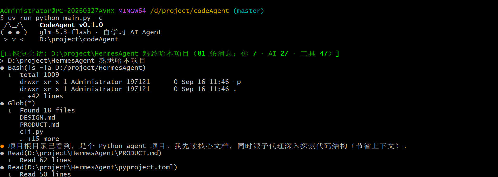

# CodeAgent

> A self-improving AI agent for your terminal — a claude-code-caliber interactive experience, Windows-first, batteries included.

[](https://www.python.org/)
[](./LICENSE)
[]()

English | [简体中文](./README.md)

CodeAgent is a terminal-based AI coding assistant: describe what you want in plain language, and it reads code, edits files, runs commands, and fetches information until the job is done. It also grows with you — it distills reusable skills from your conversation history, so it gets handier the more you use it.

## ✨ Features

**Terminal experience (modeled after claude code)**
- Streaming answers in rounded frames, dimmed thinking panes, tool event lines (`● Bash(...)` + `⎿ result`)
- **Approval panels** for destructive commands and writes outside the whitelist: allow once / always allow / deny — the panel erases itself once answered, keeping your context clean
- Clear-cut Ctrl+C semantics: one press interrupts the running turn, double press force-exits; on an approval panel, one Ctrl+C dismisses it and interrupts the whole turn
- Themeable skins, status bar, command completion, input history, large-paste-to-file references

**Models & tools**
- Multi-model support: OpenAI-compatible APIs (DeepSeek by default) and the Anthropic protocol; a main model plus a cheap auxiliary model for chores like compression, retrieval, and memory extraction
- Self-registering tool system: modules under `tools/` register on import; toolsets control which tools are exposed to the model
- MCP external tools: declare them in a project-level `.mcp.json`; first connection requires approval
- Built-in tools cover file I/O, terminal execution, search, code retrieval, web fetching, background tasks, sub-agent delegation, and more

**Security**
- Approval for destructive commands plus a cross-session whitelist (per command or per prefix rule)
- Injection-surface detection (`$()`, process substitution, and other "what you see isn't what runs" forms escalate to approval), removal-path red lines, self-protection
- Secret scanning (keeps API keys out of files and memories), SSRF guarding, web-content injection isolation
- Optional bwrap sandboxing on Linux

**Memory & self-learning**
- Long-term memory: `MEMORY.md` index + JSONL store; retrieval results are injected ephemerally, never polluting the formal history
- Skill system: user skills + marketplace skills (managed via `/plugin`), with conditional activation by touched file paths
- Self-learning pipeline: observes conversation traces and distills new skills (heuristic or auxiliary-model observation)

**Collaboration & automation**
- Sub-agents: synchronous or background delegation, worktree isolation; unattended background agents fail closed instead of self-approving
- Team mode: coordinator / workers / message bus / mailboxes
- Workflow engine: deterministic orchestration, journaled resume, spend caps
- Cron jobs, declarative hooks, task lists, session checkpoints (`/rewind`)

**Context engineering**
- Tiered compression (L1 light trimming → L4 deep summaries), between-batch tool summaries, time-based stale-result cleanup
- Prefix-cache friendly: ephemeral message injection and stripping are carefully timed to preserve cache prefixes

## 🖥 Screenshots

<!-- Placeholder: run `uv run python main.py`, take two screenshots (main conversation UI +
     approval panel), drop them into screenshots/, then uncomment below


-->

📷 Screenshots pending: one of the main conversation UI and one of the approval panel — drop them into `screenshots/` and uncomment above.

## 🚀 Quick Start

Prerequisites: [Python 3.11+](https://www.python.org/) and [uv](https://docs.astral.sh/uv/).

```bash
# 1) Install uv (skip if you have it)
#    Windows (PowerShell):  powershell -ExecutionPolicy ByPass -c "irm https://astral.sh/uv/install.ps1 | iex"
#    macOS / Linux:         curl -LsSf https://astral.sh/uv/install.sh | sh

# 2) Clone & install dependencies
git clone https://github.com/Harvil1/codeAgent.git
cd codeAgent
uv sync

# 3) Provide an API key (either way)
#    a) Environment variable — set one of the following and it's auto-detected:
#       DEEPSEEK_API_KEY / OPENAI_API_KEY / ANTHROPIC_API_KEY /
#       OPENROUTER_API_KEY / ZHIPUAI_API_KEY (BIGMODEL_API_KEY also works)
#    b) Put it into ~/.codeAgent/settings.json under models.<name>.api_key
#       (a default config file is generated on first run; DeepSeek is the default provider)

# 4) Run it
uv run python main.py              # interactive mode
uv run python main.py -c           # resume the most recent session
```

> Tip: to switch models or providers, run `/model` in a session and follow the wizard, or edit `~/.codeAgent/settings.json` directly.

## ⌨️ Everyday Commands

Over 40 slash commands are available in a session; the highlights:

| Command | What it does |
|---|---|
| `/help` | Command help |
| `/model` | Switch / configure models (guided: provider, key, endpoint) |
| `/new` `/resume` `/sessions` | New session / resume / session list |
| `/rewind` | Rewind to a checkpoint |
| `/skills` `/plugin` | Manage skills / plugin marketplace |
| `/memory` | Inspect and maintain long-term memory |
| `/permission` `/sandbox` `/approved` | Permission mode / sandbox toggle / approved-command whitelist |
| `/doctor` | Self-diagnostics (config, network, component health) |
| `/plan` | Plan mode: propose a plan, get approval, then act |
| `/stats` `/usage` `/trace` | Spend stats / usage / call tracing |

## ⚙️ Configuration & Data

Runtime data lives under `~/.codeAgent/` (override with the `CODEAGENT_HOME` environment variable — handy for testing or multiple profiles):

| Path | Contents |
|---|---|
| `settings.json` | All configuration (defaults have a single source in code; writes deep-merge, safe to hand-edit) |
| `sessions.db/` | Session persistence (JSONL) |
| `MEMORY.md` + memory store | Long-term memory index and contents |
| `skills/` | User skills |
| `plugins/` | Plugins (including the official `claude-plugins-official` marketplace) |
| `logs/` | Rolling run logs (5MB × 3) |

## 🏗 Architecture at a Glance

One-line call chain: `main.py` (ignition: console encoding, terminal bootstrap) → `cli.main` → `run_interactive` (REPL + slash commands + RuntimeContext assembly) → `AIAgent.run_conversation` (the beating heart).

Each turn of the main loop: assemble messages (injecting background / scheduled / team / plan ephemeral messages) → context compression → refresh toolset → call the LLM → dispatch tool calls; the turn ends when the model stops requesting tools.

| Subsystem | Modules |
|---|---|
| LLM | `llm_client.py` (OpenAI-compatible / Anthropic protocol), `aux_llm.py` (auxiliary model router) |
| Memory | `memory_store.py`, `memory_retriever.py` |
| Context | `context_compressor.py` (tiered compression), `context_pipeline.py` |
| Sub-agents / teams | `tools/delegate_tool.py`, `agent/team/` |
| Workflows | `workflow_engine.py` + `workflow_journal.py` |
| Skills | `~/.codeAgent/skills/` + `agent/skill_learning/` (self-learning) |
| Security | `bash_injection.py`, `ssrf_guard.py`, `secret_scanner.py`, `sandbox_runner.py`, `permission.py` |
| Persistence | `session_store.py`, `task_store.py`, `hooks.py` |

## 🧪 Development

```bash
uv run python scripts/verify.py   # 60+ regression checks (run this after any change)
uv run ruff check .               # lint
```

## ❓ FAQ

- **Which terminals are supported?** cmd, Windows Terminal, and PowerShell work out of the box; under git-bash (mintty) the app relaunches itself via winpty automatically.
- **What about Linux / macOS?** Development and verification are Windows-first; Linux runs fine (including bwrap sandbox support), and macOS should work but is not thoroughly tested.
- **Do I have to use DeepSeek?** No. Any OpenAI-compatible or Anthropic-protocol endpoint works — configure via `/model` or `settings.json`; keys can come from environment variables or the config file.
- **Where is my data?** Everything lives under `~/.codeAgent/` — delete the directory for a full reset.

## 📄 License

[MIT](./LICENSE) © 2026 Harvil1
